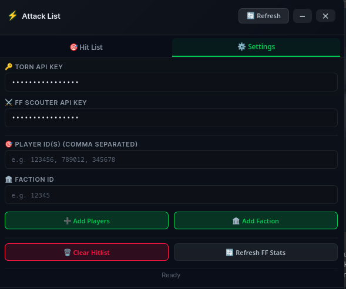
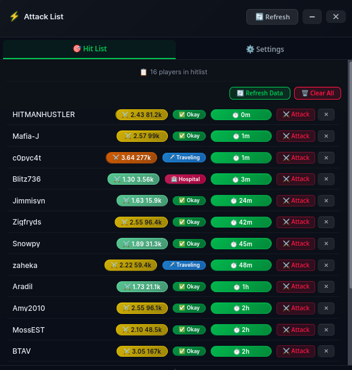

# Torn Attack List - Tampermonkey Script 
# By c0pyc4t [4039125]

<details>
<summary>📸 View Screenshots</summary>

### Dashboard Widget





</details>

[🟢 Install Script Via Gist](https://gist.githubusercontent.com/copycat1337/0c912d6fc5d74a21f1514bcea13ed6ed/raw/f39178b331d49299143fad0cb6c8dd0286be9ff3/torn_hitlist.user.js)


## 📋 Description

A powerful Tampermonkey script for Torn that creates and manages an attack list with FF Scouter integration.

Track player activity, status, and Fair Fight (FF) stats all in one place.

## ✨ Features

### 🎯 Hit List Tab

* **Player Management**: Add players individually or by faction ID
* **Real-time Status**: See if players are Online, Hospitalized, or Traveling
* **FF Scouter Integration**: Display Fair Fight (FF) stats with color-coded difficulty:

  * 🟢 Extremely easy (FF ≤ 1.0)
  * 🟡 Moderately difficult (FF 1.0-3.5)
  * 🟠 Difficult (FF 3.5-4.5)
  * 🔴 May be impossible (FF > 4.5)
* **Activity Tracking**: Shows last seen time with color-coded badges
* **Quick Attack**: Click the player name or Attack button to open the attack page
* **Remove Options**: Remove individual players or clear the entire hit list

### ⚙️ Settings Tab

* **Torn API Key**: Securely store and manage your Torn API key
* **FF Scouter API Key**: Store your FF Scouter API key
* **Add Players**: Bulk add players using comma-separated IDs
* **Add Faction**: Import an entire faction by ID
* **Refresh FF Stats**: Force refresh Fair Fight data for all players

### 🎨 Interface

* **Minimize/Restore**: Shrink the panel to a small bar using the `−` / `□` button
* **Hide/Show**: Completely hide the panel using the `✕` button
* **Draggable**: Move the panel anywhere on screen. Position is saved automatically
* **Auto-Refresh**: Automatically updates data every hour
* **Dark Theme**: Modern dark interface with smooth animations

## 🚀 Installation

1. Install the [Tampermonkey](https://www.tampermonkey.net/) browser extension.
2. Click the script link or create a new userscript.
3. Copy and paste the script code.
4. Save the script with `Ctrl+S` / `Cmd+S`.
5. The script will appear on [Torn.com](https://www.torn.com/) pages.

## 🔑 Required API Keys

### Torn API Key

1. Go to [Torn API Preferences](https://www.torn.com/preferences.php?tab=api).
2. Create a new API key with **Limited access**.
3. Required permissions:

   * **Profile**
   * **Faction**

### FF Scouter API Key

1. Go to [FF Scouter](https://ffscouter.com/).
2. Register an account.
3. Obtain your API key from your account.

## 📝 Usage

### Adding Players

1. Open the **Settings** tab.
2. Enter your Torn API Key if it is not already configured.
3. Enter your FF Scouter API Key if you want FF stats.
4. **Individual players**: Enter comma-separated player IDs in the `Player ID(s)` field.
5. **Faction**: Enter the faction ID in the `Faction ID` field.
6. Click the corresponding button to add them.

### Managing the Hit List

* Click **🎯 Hit List** to view all players.
* Click a **player name** or **⚔️ Attack** button to open their attack page.
* Click **✕** next to a player to remove them.
* Use **🗑️ Clear All** to remove everyone from the hit list.
* Click **🔄 Refresh Data** to update player information.

### Panel Controls

* **🔄 Refresh**: Force refresh all data
* **− / □**: Minimize or restore the panel
* **✕**: Completely hide the panel

> **Note:** When the panel is hidden, use the Tampermonkey menu to show it again.

### Tampermonkey Menu Options

Right-click the Tampermonkey icon and open **Torn Attack List**:

* **🔑 Set Torn API Key**: Update your Torn API key
* **🔑 Set FF Scouter API Key**: Update your FF Scouter API key
* **📌 Minimize/Restore Panel**: Toggle the minimized state
* **👁️ Show/Hide Panel**: Toggle the panel visibility
* **🗑️ Clear All Cached Data**: Reset all stored data

## ⚙️ Configuration

The following settings can be adjusted near the top of the script:

```javascript
const API_DELAY = 700;           // ms between API calls
const FF_API_DELAY = 600;        // ms between FF API calls
const AUTO_REFRESH_INTERVAL = 60 * 60 * 1000; // Auto-refresh every hour
const MAX_API_CALLS_PER_MINUTE = 95; // Rate limit safety
```

### Performance Settings

| `API_DELAY` | Mode     | Approx. Calls/Min |
| ----------: | -------- | ----------------: |
|      `1000` | Safe     |           ~60/min |
|       `700` | Balanced |           ~85/min |
|       `600` | Fast     |          ~100/min |

> ⚠️ **Warning:** Do not set `API_DELAY` below `600` to avoid approaching Torn's API rate limits.

## 📊 Display Legend

### Status Badges

* 🟢 **Online** - Player is currently online
* 🏥 **Hospital** - Player is hospitalized
* ✈️ **Traveling** - Player is traveling
* ✅ **Okay** - Player is available

### Activity Time Colors

* 🟢 **Green**: Recent activity (< 4 hours)
* 🟡 **Yellow**: Moderate activity (4-15 hours)
* 🟠 **Orange**: Inactive (15-24 hours)
* 🔴 **Red**: Very inactive (1-7 days)
* ⚫ **Black**: Extremely inactive (> 7 days)

### FF Difficulty Colors

* 🟢 **Green**: Extremely easy (FF ≤ 1.0)
* 🟡 **Yellow**: Moderately difficult (FF 1.0-3.5)
* 🟠 **Orange**: Difficult (FF 3.5-4.5)
* 🔴 **Red**: May be impossible (FF > 4.5)

## 🛠️ Troubleshooting

### "No data loaded"

* Check that your Torn API Key is configured correctly.
* Click **Refresh Data** to fetch player information.

### "Rate limit approaching"

* The script automatically handles API rate limits.
* It will wait and retry when API calls are limited.

### FF Stats Showing "❓ No FF"

* Your FF Scouter API key may be missing or invalid.
* Click **Refresh FF Stats** to retry.

### Panel Not Showing

* Make sure Tampermonkey is enabled on [Torn.com](https://www.torn.com/).
* Open the Tampermonkey menu.
* Select **👁️ Show/Hide Panel**.

## 📦 Data Storage

The script stores data locally using `GM_setValue`.

Stored information includes:

* Player list and activity data
* FF Scouter cache with 24-hour expiry
* Panel position and state
* API keys

All stored data remains local to your browser.

## 🔒 Privacy

* All API keys are stored locally in your browser.
* No data is sent to any server except the Torn and FF Scouter APIs.
* No tracking or analytics are used.


